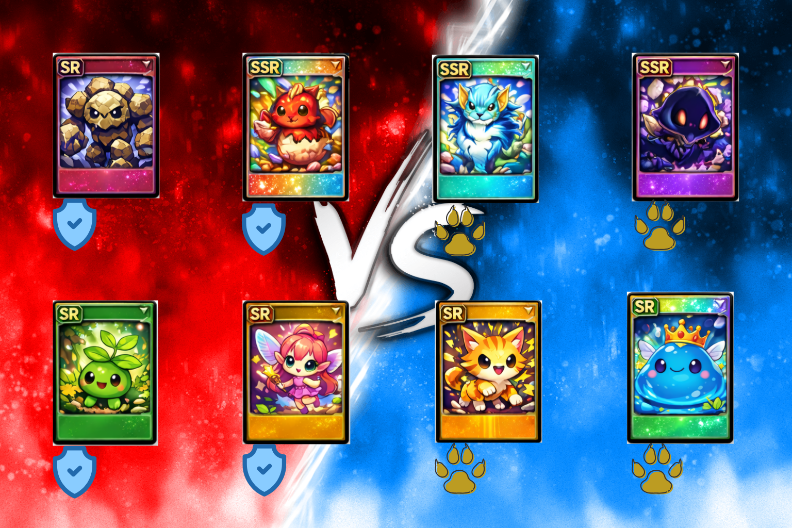

# カードバトルゲーム（CLI)

4人パーティ同士が戦う、ターン制カードバトルゲームです。  
攻撃・回復・支援・防御を使い分けながら、相手パーティの全滅を目指します。

## イメージ



※ 画像はイメージです（実際のゲーム画面は CLI で表示されます）

## 特徴
- ダイスによるランダム性のあるバトル
- アタッカー／ヒーラー／サポーター／タンクの役割分担
- デバフ・回復による駆け引き
- 後半フェーズでテンポよく決着

## 基本ルール
- 各パーティ4人編成
- HPが0になると戦闘不能
- 先に相手パーティを全滅させた側が勝利
- 1バトルは約7〜12ターンで決着

## 実行方法
```bash
python battle_mvp.py
```
## 乱数(seed)について
- 乱数の再現性のため seed を使用しています
- デフォルトでは seed=1 を使用しています

## サンプルログ（一部抜粋）
```text
=== Battle Start: A vs B ===
[A]
  - A_Att      ATTACKER  HP=100/100 ATK=6 VIT=4 SPD=6
...
=== Winner: B ===
```

## 詳細ルール
▶ [戦闘ルール（RULES.md）を読む](RULES.md)
